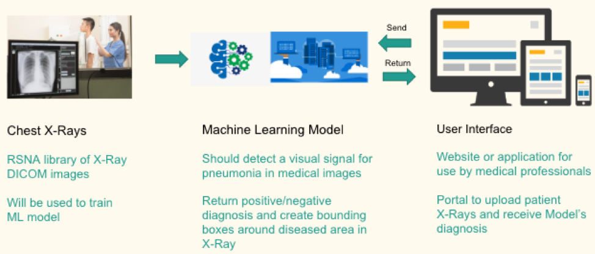

# ec601-project RSNA Pneumonia Detection
 
Kaggle link: https://www.kaggle.com/c/rsna-pneumonia-detection-challenge

# [RSNA Pneumonia Detection Challenge](https://www.kaggle.com/c/rsna-pneumonia-detection-challenge)

Author: 
Min Zhou (minzhou@bu.edu), Andrew Stoycos (astoycos@bu.edu)

[Trello](https://trello.com/b/tm5CsmTN/sprint-1) 

# File Instruction:
* `data-analysis-of-rsna-library.ipynb`  is the Jupyter Notebook for analyzing and processing our dataset.
* `app` folder is the web application of our product.
* `yolo_model` folder contains some model config files and a Jupyter Notebook used to train the model.
* `requirements.txt` is the necessary python libraries to run our code.

# Product statement:

* Doctors, patients and medical professionals, need a product to help 
them to improve the efficiency and reach of diagnostic services. 

* This is an AI (machine learning/deep learning) model which can automatically detect a signal of pneumonia in medical images. 

* Current pneumonia diagnosis must be completed by a medical professional following a chest X-Ray and physical exam

* Our product will automate initial detection (imaging screening) of potential pneumonia cases and create bounding boxes around the areas of interest in order to prioritize and expedite their review. 

# MVP:

 - [x] [Medical image analysis and processing](https://github.com/minzhou1003/ec601-project/blob/master/data-analysis-of-rsna-library.ipynb).</li>
 - [ ] A machine learning model that can predict pneumonia and return the result.
    <ul>
    <li>Pneumonia Positive</li>
    <li>Pneumonia Negative</li>
      <ul>Normal Negative</ul>
      <ul>Non-Normal Negative(other disease)</ul>
    </ul>
  - [x] [A website application to make the software accessible](https://github.com/minzhou1003/ec601-project/tree/master/app).

# System Diagram

# Machine Learning Model (Deep Learning)

* ## [YOLO v3 Model](https://github.com/minzhou1003/ec601-project/tree/master/yolo_model)

* ## Mask-RCNN model

# Sprints:

- [x] Sprint 1 (09/26/2018) 
- [x] Sprint 2 (10/17/2018)
- [ ] Sprint 3

